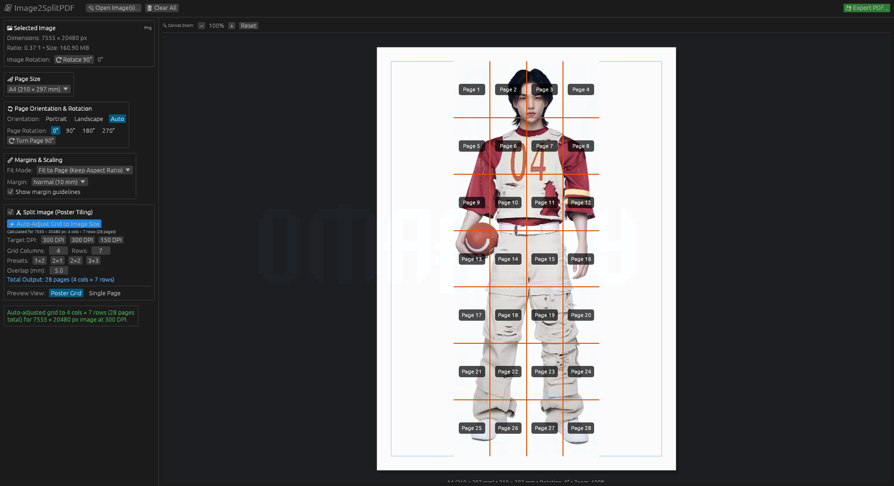

# Image2SplitPDF

A fast, lightweight, and modern Rust application with a visual interface to convert images into `.pdf` pages, with real-time live preview, flexible layout adjustments, and multi-page poster splitting.


<p align="center">
  
</p>

---

## ✨ Features

- **Extensive Format Support**:
  - Full support for `JPG` / `JPEG`, `PNG`, `BMP`, `WebP`, `GIF`, `TIFF`, `ICO`, `AVIF`, and `QOI`.
  - Transparent images (PNG, WebP, GIF) are cleanly flattened onto paper background.
- **Drag & Drop & Multi-Image Support**:
  - Drop image files directly into the window or use the native file picker (`rfd`).
  - Batch convert multiple images into a single multi-page PDF document or work with one image at a time.
  - Image metadata display: file name, dimensions, aspect ratio, file size, format.
- **Real-Time Interactive Preview**:
  - Virtual paper canvas with realistic drop shadow and true millimeter-to-point aspect ratios.
  - Live preview updates as you tweak margins, scaling, rotation, orientation, or split grid.
  - Printable margin boundary guidelines (toggleable).
  - Canvas zoom controls (zoom in/out/reset).
- **Configurable Page Sizes**:
  - **A4** (210 × 297 mm)
  - **A3** (297 × 420 mm)
  - **A5** (148 × 210 mm)
  - **Letter** (8.5 × 11 in)
  - **Legal** (8.5 × 14 in)
  - **Custom Size** (specify width & height in mm)
- **Page Orientation & Rotation**:
  - **Orientation**: Portrait, Landscape, or Auto (dynamically matches image aspect ratio).
  - **Page Rotation**: 0°, 90° Clockwise, 180° Inverted, 270° Counter-Clockwise (standard PDF `/Rotate`).
  - Quick "Turn Page 90°" button.
  - Image rotation inside the page (0°, 90°, 180°, 270°) to correct photos before exporting.
- **Margins & Scaling Modes**:
  - **Margins**: None (0 mm), Small (5 mm), Normal (10 mm), Large (20 mm), or Custom (0–100 mm).
  - **Fit Modes**:
    - **Fit to Page**: Letterbox/pillarbox to fit within margins while preserving aspect ratio.
    - **Fill Page**: Crop overflow to fill entire printable area.
    - **Stretch**: Stretch exact dimensions to margins.
    - **Original Size**: 1:1 scale (300 DPI centered).
- **✂ Multi-Page Split / Poster Tiling Mode**:
  - **⚡ Automatic Grid Adjustment**: One-click button to automatically adjust and calculate the optimal columns & rows of pages required based on image pixel dimensions, printable paper area, and target print DPI (e.g. 300 DPI high-quality, 150 DPI poster).
  - Split large images across multiple grid pages (e.g., 2×1, 1×2, 2×2, 3×3, or custom up to 25×25).
  - Configurable overlap margin (mm) for easy trimming and gluing.
  - Preview options: **Poster Grid** with visual cutlines & page numbers, or **Single Page** tile viewer.
- **Seamless PDF Generation**:
  - Native, pure-Rust PDF creation via `pdf-writer` and `miniz_oxide` zlib compression.
  - Standard compliant, compact output PDFs.
  - One-click "Open PDF" after export.

---

## 🚀 Getting Started

### Prerequisites

Ensure you have Rust and Cargo installed:
```bash
curl --proto '=https' --tlsv1.2 -sSf https://sh.rustup.rs | sh
```

### Build & Run

Run directly in development mode:
```bash
cargo run
```

Or pass an image directly via command line to immediately preview it:
```bash
cargo run -- /path/to/my_image.png
```

Build an optimized release binary:
```bash
cargo build --release
./target/release/Image2SplitPDF
```

---

## 💻 CLI Usage

Image2SplitPDF can be run entirely headlessly from the terminal for fast automation and batch processing, or interactively via GUI.

### Quick Examples

```bash
# Convert a single image to PDF
image2splitpdf photo.jpg -o document.pdf

# Convert multiple images into a multi-page PDF
image2splitpdf page1.jpg page2.png page3.webp -o combined.pdf

# Split a poster across a 2×3 grid of A4 pages
image2splitpdf poster.png --split --cols 2 --rows 3 -o poster.pdf

# Automatically calculate the optimal page grid for high-res printing (300 DPI)
image2splitpdf artwork.png --auto-grid -o artwork_split.pdf

# Auto-grid with custom DPI and 10 mm overlap margin
image2splitpdf banner.png --auto-grid 150 --overlap 10 -o banner_split.pdf

# Custom page size (A3 landscape) with 5 mm margin
image2splitpdf schematic.png -s A3 -r landscape -m small -o schematic.pdf

# Open the GUI with an image pre-loaded
image2splitpdf photo.jpg
```

### CLI Options

| Option | Flag | Description | Default |
|---|---|---|---|
| `-o, --output <FILE>` | Output Path | Destination `.pdf` path (triggers CLI mode) | `<input_name>.pdf` |
| `-c, --cli` | Force CLI | Run headless CLI mode even without `-o` | `false` |
| `-g, --gui` | Force GUI | Launch GUI even if CLI options are specified | `false` |
| `-s, --page-size <SIZE>` | Page Size | `A4`, `A3`, `A5`, `Letter`, `Legal`, or `WIDTHxHEIGHT` mm | `a4` |
| `-r, --orientation <MODE>`| Orientation | `portrait`, `landscape`, or `auto` | `auto` |
| `--page-rotation <DEG>` | Page Rotation | Page rotation: `0`, `90`, `180`, `270` | `0` |
| `--image-rotation <DEG>`| Image Rotation | Rotate input image clockwise: `0`, `90`, `180`, `270` | `0` |
| `-m, --margin <MARGIN>` | Margin | `none`, `small` (5mm), `normal` (10mm), `large` (20mm), or mm | `normal` |
| `-f, --fit <MODE>` | Fit Mode | `fit`, `fill`, `stretch`, or `original` | `fit` |
| `--split` | Split Mode | Enable multi-page poster split tiling | `false` |
| `--cols <N>` | Columns | Grid columns for split mode | `2` |
| `--rows <N>` | Rows | Grid rows for split mode | `2` |
| `--auto-grid [<DPI>]` | Auto Grid | Automatically calculate optimal grid pages based on DPI | `300.0` |
| `--overlap <MM>` | Overlap | Overlap margin in mm between split tiles | `5.0` |
| `-v, --verbose` | Verbose | Show detailed processing logs | `false` |
| `-h, --help` | Help | Print help screen and examples | |
| `-V, --version` | Version | Print version information | |


### Install as an Omarchy / Desktop App (Executable from Launcher)

To install Image2SplitPDF as a desktop app with its icon and desktop launcher:

```bash
./install.sh
```

This will:
1. Build the release binary and copy it to `~/.local/bin/image2splitpdf`.
2. Install the TokyoNight-styled SVG icon to `~/.local/share/icons/hicolor/scalable/apps/image2splitpdf.svg`.
3. Install the `.desktop` launcher entry to `~/.local/share/applications/image2splitpdf.desktop`.
4. Refresh the desktop database and icon caches.

Once installed:
- Press <kbd>SUPER</kbd> + <kbd>ALT</kbd> + <kbd>SPACE</kbd> (Omarchy Apps menu) or <kbd>SUPER</kbd> + <kbd>SPACE</kbd> (Omarchy menu) and type `Image2SplitPDF`.
- Right-click images in your file manager to open them in Image2SplitPDF.
- Launch from terminal via `image2splitpdf [optional_image_path]`.

To uninstall:
```bash
./uninstall.sh
```


### Running Tests

Execute the automated test suite verifying image decoding, PDF generation, and poster tiling across all formats:
```bash
cargo test
```

---

## 🛠 Architecture

- [`src/main.rs`](file:///home/bazoo/Projects/Image2SplittedPDF/src/main.rs): Application entry point, CLI arguments handler, and viewport configuration.
- [`src/app.rs`](file:///home/bazoo/Projects/Image2SplittedPDF/src/app.rs): `eframe::App` GUI implementation, sidebar controls, drag-and-drop, and live paper preview renderer.
- [`src/pdf.rs`](file:///home/bazoo/Projects/Image2SplittedPDF/src/pdf.rs): PDF generation engine (`pdf-writer`), unit conversions, page geometries, and grid tiling logic.
- [`src/image_loader.rs`](file:///home/bazoo/Projects/Image2SplittedPDF/src/image_loader.rs): Image loading, metadata extraction, orientation correction, and egui texture preparation.
- [`tests/conversion_test.rs`](file:///home/bazoo/Projects/Image2SplittedPDF/tests/conversion_test.rs): Integration test verifying JPG, PNG, BMP, and WebP conversion to A4, A3, and split PDFs.

---

## 📄 License

MIT
